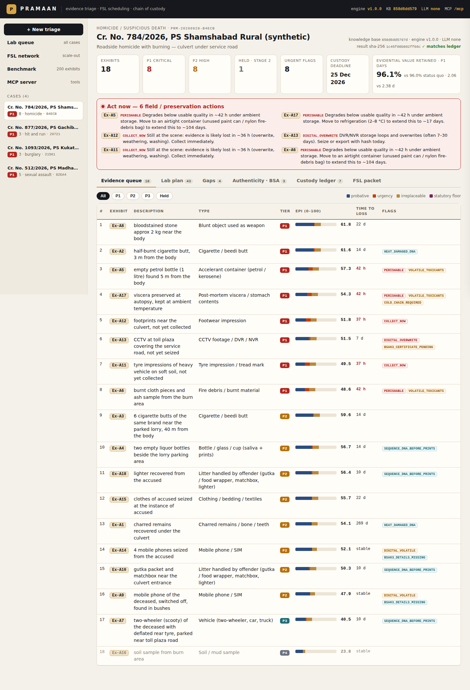
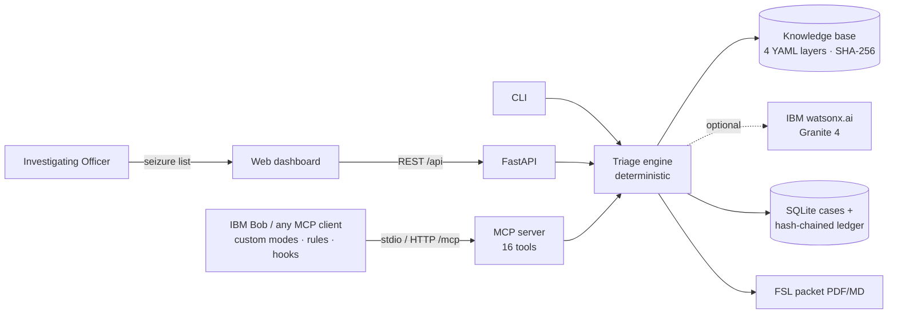

# Pramaan — AI Crime-Scene Evidence Triage & FSL Scheduling (MCP)

> Explainable evidence triage for Indian forensic science laboratories: an MCP server, REST API and web dashboard that turn an officer's seizure list into a ranked, flagged, sequenced and scheduled FSL submission — with a tamper-evident chain of custody.

   -0F62FE) 

**Team:** Team Pramaan · **Track:** AI · **Demo video:** see [`demo/demo-video-link.txt`](demo/demo-video-link.txt) · **Slides:** [`presentation/slides.pdf`](presentation/slides.pdf)



---

## Why

In the 2019 Hyderabad veterinarian case investigators seized **200+ items and 3,000+ photographs**; a **DNA-bearing cigarette butt** that helped link the accused was nearly lost among roadside litter, and overloaded FSLs delay testing by weeks. BNSS 2023 now mandates forensic scene visits for serious offences (§176(3)) while the custody clock (§187(3), 60/90 days) keeps running. Laboratories still largely examine exhibits **first-come, first-served**. → [Problem statement](docs/problem-statement.md)

## What it does

Pramaan follows the design of [SAVVYDFIR-MCP](https://github.com/kismatkunwar89/SAVVYDFIR-MCP): a purpose-built **MCP server** whose forensic reasoning lives in **editable knowledge YAML**, not in a model; findings carry **caveats** and **corroborate-with** guidance; every action lands in a **hash-chained audit log**.

| Step | Output |
|---|---|
| Parse the free-text seizure list | exhibits with labels, quantities, distances, storage condition, "not yet collected" |
| Classify (41 evidence types, modifiers, context) | type, category, confidence, method (hint / rules / llm / fallback) |
| Model degradation by storage condition | quality now, hours to risk, preservation what-if, field window |
| **Evidentiary Priority Index** `EPI = 100·(w_p·P + w_u·U + w_r·R)` | explainable 0–100 score + rationale |
| Urgent-testing flags | **ACT NOW** list: collect, seal airtight, refrigerate, seize DVR today |
| Sequence examinations (DAG, least destructive first) | e.g. touch-DNA swab → powdering → comparison |
| Tier, stage and override | P1–P4, staged testing with near-body exemption, reference promotion, logged overrides |
| Schedule the FSL (ATC portfolio vs baselines) | Gantt by division/examiner, custody-deadline aware, lab-wide queue across cases |
| Gap analysis | missing reference samples, fingernail scrapings, CCTV canvass, photo coverage |
| Outputs + ledger | `state.json`, `audit.jsonl`, `report.html`, `graph.html`, `packet.pdf`; SHA-256 hash chain, result & KB hashes |

→ [Solution overview](docs/solution-overview.md) · [Scoring algorithm](docs/scoring-algorithm.md)

## Law-enforcement module — evidence authenticity under BSA 2023

Every electronic exhibit (CCTV/DVR, phone, computer) is checked against the **Bharatiya Sakshya Adhiniyam, 2023**: s.61 recognition, s.62 mode of proof, s.63(2)(a)-(d) reliability conditions, s.63(4) Schedule certificate (Part A by the person in charge, Part B by an expert, with hash), hash verified at the FSL, plus BNSS s.105 seizure videography and chain-of-custody facts for every physical exhibit. Status **READY / CURABLE GAPS / AT RISK** with remedies, an authenticity report PDF, and pre-filled s.63(4) certificate drafts. Legal flags never change forensic priority. → [Legal module](docs/legal-bsa-evidence-authenticity.md) · [legal analysis PDF](docs/legal/BSA-2023-evidence-authenticity-analysis.pdf)

## Scales from one lab to the state FSL network

2000 exhibits from 10 Hyderabad-scale cases triaged in 4.51 s (443/s). The network planner assigns each exhibit to State FSL HQ, a Regional FSL or the CFSL (referral) where it completes earliest incl. transport — P1 results in **38.39 vs 84.85** working days vs everything-to-HQ, planned in 10 ms — and answers capacity what-ifs (+N examiners per division). → [FSL scalability](docs/fsl-scalability.md) · [Criteria → code map](docs/judging-criteria.md)

## Measured, not claimed

`python -m pramaan benchmark` — synthetic 200-exhibit scene with the Hyderabad shape (fixed seed; five hidden "needles"):

| Metric | **Pramaan** | Status quo (all exhibits, listing order) |
|---|---|---|
| Evidential value retained | **93.2%** | 85.5% |
| Perishable exhibits' value retained | **90.9%** | 80.5% |
| Late exhibits | **0** | 13 |
| P1 results (mean working days) | **6.6** | 29.3 |
| Needles surfaced as P1 | **5 / 5** | — |

Heuristic half-lives and lab capacities, synthetic data — see [evaluation & limitations](docs/evaluation.md).

## Architecture

```
  Scene Inputs                       Pramaan Engine                  MCP Server
  ────────────                       ──────────────                  ──────────
  seizure list (free text)   ───>   extractor, classifier     ───>  ┌──────────────────┐
  scene context, custody     ───>   degradation, scoring      ───>  │  pramaan-mcp     │
  photo captions             ───>   sequencing, staging       ───>  │  (MCPServer,     │
  knowledge/*.yaml (4 KB)    ───>   scheduler (ATC), gaps     ───>  │   21 tools)      │
                                    reports (PDF / HTML)      ───>  │                  │
                                                                    │  PrivacyGate     │
                                                                    │  AuditLedger     │
                                                                    │  CaseStore       │
                                                                    └────────┬─────────┘
                                                                             │ streamable HTTP /mcp
                                                                             │ (or stdio) JSON-RPC
                                                                             v
                                                                    ┌──────────────────┐
                                                                    │  IBM Bob         │
                                                                    │  Agent Loop      │
                                                                    │                  │
                                                                    │  AGENTS.md       │
                                                                    │  Mode:           │
                                                                    │  forensic-triage │
                                                                    │  Skill:          │
                                                                    │  .bob/skills/    │
                                                                    │  evidence-triage-│
                                                                    │  workflow        │
                                                                    │  Hooks:          │
                                                                    │  .bob/settings   │
                                                                    └────────┬─────────┘
                                                                             │
                                                                             v
                                                                    ┌──────────────────┐
                                                                    │  Output          │
                                                                    │                  │
                                                                    │  state.json      │
                                                                    │  audit.jsonl     │
                                                                    │  report.html     │
                                                                    │  graph.html      │
                                                                    │  packet.pdf      │
                                                                    │  case-notes/*.md │
                                                                    └──────────────────┘
        Web dashboard http://127.0.0.1:8000 reads the same CaseStore + AuditLedger live
```




→ [Architecture](docs/architecture.md) (pipeline, sequence and data diagrams)

### Knowledge layers & how to extend

| Layer | File | Carries |
|---|---|---|
| 1. Laboratory | `src/pramaan/knowledge/laboratory.yaml` | 9 FSL divisions, examiners, 27 examinations with hours, stage, destructive flag, precedence |
| 2. Evidence types | `src/pramaan/knowledge/evidence_types.yaml` | 41 types: keywords (incl. Indian usage — *beedi, gutka, scooty, dupatta*), exam plan, individualizing potential, replaceability, field windows, **caveat**, **corroborate_with**, handling; modifiers; context signals; staging |
| 3. Degradation | `src/pramaan/knowledge/degradation.yaml` | 11 half-life profiles × 7 storage conditions, risk threshold, preservation advice |
| 4. Crime profiles | `src/pramaan/knowledge/crime_profiles.yaml` | 11 crime types: relevance by category, weights, max punishment, key questions, expected-evidence gap rules |

The loader validates every cross-reference and **fails closed**; its SHA-256 is stamped on every result. → [Knowledge base guide](docs/knowledge-base.md)

## Use it from IBM Bob

The repo ships a ready IBM Bob workspace, mirroring SAVVYDFIR-MCP's Claude Code layout: **`AGENTS.md`** (the agent protocol, like `CLAUDE.md`), **7 skills** in `.bob/skills/` (7-phase `evidence-triage-workflow`, classification, preservation & custody, FSL scheduling, court-ready outputs, BSA authenticity, tools reference), **4 custom modes** (🔬 Forensic Triage Officer, 🧪 FSL Liaison, ⚖️ Court Readiness Reviewer, 🛡️ Law-Enforcement Legal Cell), mode **rules**, **slash commands** (`/triage-scene`, `/fsl-packet`, `/lab-queue`, `/verify-custody`, `/bsa-check`), `.bob/mcp.json`, and **5 lifecycle hooks** (briefing, privacy block, evidence-store write guard, MCP audit, Stop completion gate). `bob_config/` installs it globally. Start the backend with `PRAMAAN_MCP_ACTOR=ibm-bob python -m pramaan serve`, open the folder in Bob, pick the mode and paste a seizure list — the case appears in the dashboard live. → **[docs/bob-integration.md](docs/bob-integration.md)**

## MCP server

21 typed tools, 3 resources, 1 prompt — `list_crime_profiles`, `lookup_evidence_type`, `parse_scene_description`, `triage_scene`, `list_cases`, `get_case`, `explain_item_priority`, `update_item`, `simulate_preservation`, `build_fsl_schedule`, `lab_queue`, `gap_analysis`, `generate_submission_packet`, `record_custody_event`, `verify_custody_ledger`, `export_case_outputs`, `record_electronic_evidence`, `assess_evidence_authenticity`, `generate_bsa63_certificate`, `plan_fsl_network`, `describe_tool_catalog`.

```json
{ "mcpServers": { "pramaan": { "command": "python", "args": ["-m", "pramaan.mcp_server"], "env": { "PYTHONPATH": "src" } } } }
```

A real client↔server session: [`demo/mcp-session-transcript.md`](demo/mcp-session-transcript.md) · Reference: [docs/mcp-tools.md](docs/mcp-tools.md)

## Quick start

```bash
git clone <this-repo> && cd <this-repo>/src
python -m venv .venv && source .venv/bin/activate        # Windows: .venv\Scripts\activate
pip install -r requirements-dev.txt
pytest                                                    # 46 tests
python -m pramaan seed                                    # 4 synthetic scenarios
python -m pramaan serve                                   # http://127.0.0.1:8000  (MCP: /mcp)
```

Or `docker compose up --build`. → [Setup guide](docs/setup-guide.md) (MCP client setup, watsonx.ai, troubleshooting)

## Repository structure

```
├── submission.yaml            hackathon metadata
├── AGENTS.md                  IBM Bob agent protocol (≈ CLAUDE.md), auto-loaded
├── .bob/                      IBM Bob: mcp.json, skills/, custom_modes.yaml, rules*/, commands/, settings.json hooks
├── bob_config/                global Bob install (≈ claude_config/)
├── .bobignore                 keeps Bob out of the evidence store
├── case-notes/                where Bob saves FSL packets
├── .mcp.json                  generic MCP client config (stdio + HTTP)
├── docs/                      problem, solution, architecture, setup, Bob integration, scoring, MCP, API, evaluation, security, KB
├── demo/                      video link, screenshots (10), MCP session transcript, demo script
├── presentation/              slides.pptx + slides.pdf
├── src/
│   ├── pramaan/               engine, MCP server, API, CLI, reports, knowledge/*.yaml, llm/
│   ├── web/                   dashboard (vanilla HTML/CSS/JS, no CDN)
│   ├── scenarios/             synthetic cases with ground-truth expectations
│   ├── tests/                 pytest suite
│   └── scripts/               capture_demo.py, presubmit_check.py
├── Dockerfile · docker-compose.yml · Makefile
└── .github/workflows/         validate.yml (hackathon) · ci.yml (tests + benchmark)
```

## Responsible use

Decision support only: the IO decides and the FSL may re-order on scientific grounds. No personal names are accepted (BNS §72, DPDP Act 2023) — a privacy gate in code rejects Aadhaar, phone and e-mail patterns and hashed protected terms. All scenarios are synthetic. → [Security, legal & ethics](docs/security-and-legal.md)

## License

MIT — see [LICENSE](LICENSE).

## PRAMAAN-X M1-M5 live wiring (patched build)

This build connects the five AI modules to both IBM Bob/MCP and the web dashboard.

- **M1 Granite text extraction**, **M3 MiniLM**, and **M4 DeBERTa NLI** run on every dashboard **Run PRAMAAN-X AI triage** and on Bob's `analyze_scene_ai` text path.
- Attach a JPG/PNG in the dashboard to execute **M2 YOLO-World**.
- Tick **Also run M5 Granite Vision** to execute **M5** on the same photographs.
- Open **AI control** in the sidebar for process-level M1-M5 status.
- Open a saved case's **AI Control · M1–M5** tab for its persisted GuardRail, model-runtime proof, reconciliation, Digital Twins, contradictions and visual candidates.
- `INFERENCE_OK` plus a UTC timestamp means the model actually completed inference. `NOT_LOADED` means it has not been requested in the current backend process.

Direct verification from `src`:

```powershell
C:\Python314\python.exe scripts\verify_ai_wiring.py
C:\Python314\python.exe scripts\verify_ai_wiring.py --image D:\ibm\test_scene.jpg --run-m5
```

See `MODEL_WIRING_CHECK.md` for the complete mapping.
