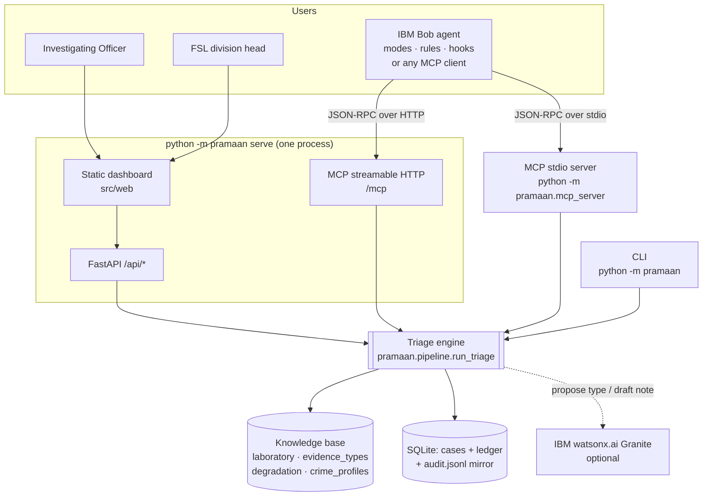
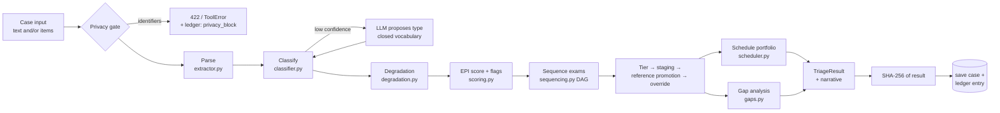
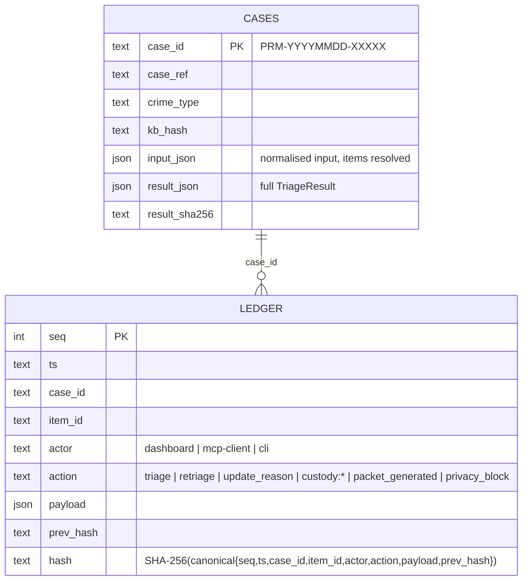

# Architecture

Pramaan is **one deterministic engine with three surfaces** (MCP server, REST API + dashboard, CLI) over **one store** (SQLite in WAL mode: cases + hash-chained ledger). The forensic knowledge lives in four YAML files whose combined SHA-256 is stamped on every result.

## 0. At a glance (same layout as SAVVYDFIR-MCP)

```
  Scene Inputs                       Pramaan Engine                  MCP Server
  ────────────                       ──────────────                  ──────────
  seizure list (free text)   ───>   extractor, classifier     ───>  ┌──────────────────┐
  scene context, custody     ───>   degradation, scoring      ───>  │  pramaan-mcp     │
  photo captions             ───>   sequencing, staging       ───>  │  (MCPServer,     │
  knowledge/*.yaml (4 KB)    ───>   scheduler (ATC), gaps     ───>  │   21 tools)      │
                                    reports (PDF / HTML)      ───>  │                  │
                                                                    │  PrivacyGate     │
                                                                    │  AuditLedger     │
                                                                    │  CaseStore       │
                                                                    └────────┬─────────┘
                                                                             │ streamable HTTP /mcp
                                                                             │ (or stdio) JSON-RPC
                                                                             v
                                                                    ┌──────────────────┐
                                                                    │  IBM Bob         │
                                                                    │  Agent Loop      │
                                                                    │                  │
                                                                    │  AGENTS.md       │
                                                                    │  Mode:           │
                                                                    │  forensic-triage │
                                                                    │  Skill:          │
                                                                    │  .bob/skills/    │
                                                                    │  evidence-triage-│
                                                                    │  workflow        │
                                                                    │  Hooks:          │
                                                                    │  .bob/settings   │
                                                                    └────────┬─────────┘
                                                                             │
                                                                             v
                                                                    ┌──────────────────┐
                                                                    │  Output          │
                                                                    │                  │
                                                                    │  state.json      │
                                                                    │  audit.jsonl     │
                                                                    │  report.html     │
                                                                    │  graph.html      │
                                                                    │  packet.pdf      │
                                                                    │  case-notes/*.md │
                                                                    └──────────────────┘
        Web dashboard http://127.0.0.1:8000 reads the same CaseStore + AuditLedger live
```

## 1. System context



The stdio MCP server and the web process open the same SQLite file (`PRAMAAN_HOME`), so cases created by an agent appear in the dashboard, and both actors appear in one ledger. Appends are serialised with `BEGIN IMMEDIATE`, so the hash chain never forks.

## 2. Triage pipeline



| Module | Responsibility |
|---|---|
| `privacy.py` | Rejects Aadhaar / mobile / e-mail patterns and hashed protected terms on every surface |
| `extractor.py` | Splits seizure lists (lines, bullets, `;`, multi-object sentences); labels, quantities (ignores "two-wheeler", "2 kg"), conditions, not-collected |
| `classifier.py` | Longest-keyword match over 41 types; stains yield to objects ("bloodstained stone" = blunt weapon + blood); context signals; distance proximity `0.15·e^(−d/25)` |
| `degradation.py` | Two-phase exposure, `Q = 0.5^age`, hours to 60 % threshold, better condition, field windows (÷6 in rain for weather-sensitive items) |
| `scoring.py` | EPI, statutory floor, urgent flags, tiers, rationale text |
| `sequencing.py` | Kahn topological sort over KB precedence + stage (non-destructive first); quantity factor |
| `pipeline.py` | Orchestration, staging, reference promotion, overrides, custody deadline (BNSS §187(3)), persistence |
| `scheduler.py` | Non-delay job-shop simulation; FIFO / static / ATC(k) portfolio; baselines; lab-wide queue |
| `gaps.py` | Crime-profile gap rules, grouped photo-coverage alert, batch advice |
| `reports.py` | Markdown + ReportLab PDF packet with integrity footer |
| `store.py` | Cases, hash-chained ledger, `verify()`, `verify_case()` |
| `llm/` | watsonx.ai REST client (IAM token + `/ml/v1/text/chat`) and the three allowed LLM tasks |
| `mcp_server.py` | 21 tools, 3 resources, 1 prompt; errors surfaced as `ToolError` |
| `api.py` | REST API, static dashboard, `/mcp` routes + session-manager lifespan |

## 3. MCP interaction

```mermaid
sequenceDiagram
  participant O as Officer
  participant A as MCP client (assistant)
  participant M as Pramaan MCP server
  participant E as Engine + KB
  participant L as Ledger
  O->>A: "Triage this homicide scene" + notes
  A->>M: parse_scene_description(notes)
  M->>E: parse + classify (no save)
  M-->>A: exhibit table + confidence
  A->>O: confirm list?
  O->>A: yes
  A->>M: triage_scene(case_ref, crime_type, description, times…)
  M->>E: run_triage()
  E->>L: append {triage, result_sha256, kb_hash}
  M-->>A: act_now, ranked, gaps, schedule summary, hashes
  A->>M: explain_item_priority(case, "Ex-A2")
  M-->>A: factor points, rationale, caveat, levers
  A->>M: simulate_preservation(case, "Ex-A17", refrigerated)
  M-->>A: 42 h → 17 days; EPI and case value change
  A->>M: generate_submission_packet(case)
  M->>L: append {packet_generated}
  M-->>A: markdown + pdf path
```

## 4. Data model



## 5. Scheduling model

Each exhibit is a job: its sequenced examinations run one after another (one physical object). Each operation needs one examiner of one division (capacities in `laboratory.yaml`). Each job has a **quality due time** (when quality would cross the threshold in refrigerated lab storage) and optionally a **report due time** (custody deadline − 7 days). A non-delay simulator lets the division that can start earliest pick the next operation with a dispatching rule:

* `fifo` — listing order; `priority` — static EPI; `atc(k)` — Apparent Tardiness Cost `I = (w/p)·(ε + e^(−max(slack,0)/(k·p̄)))`, `w = EPI/100 × 1.5 if urgent`.

The best of the portfolio by `value − 0.02·late − 0.002·P1_days` is recommended; **status quo** (all exhibits, listing order), **FIFO** and **static sort** are always reported beside it. `plan_lab` does the same across every open case.

## 6. Deployment

* **Laptop / air-gapped workstation:** Python 3.11+, no internet needed, no CDN in the dashboard.
* **Docker:** `docker compose up --build` (non-root user, `/data` volume, health check).
* **IBM Bob:** project `.bob/` folder (MCP config, modes, rules, hooks) — see [bob-integration.md](bob-integration.md).
* **Other MCP clients:** stdio via `.mcp.json` / `python -m pramaan mcp-config`, or HTTP at `/mcp` with DNS-rebinding protection (`PRAMAAN_ALLOWED_HOSTS`).
* **Optional cloud AI:** set `PRAMAAN_LLM_PROVIDER=watsonx` + credentials; the engine degrades to offline if unavailable.
